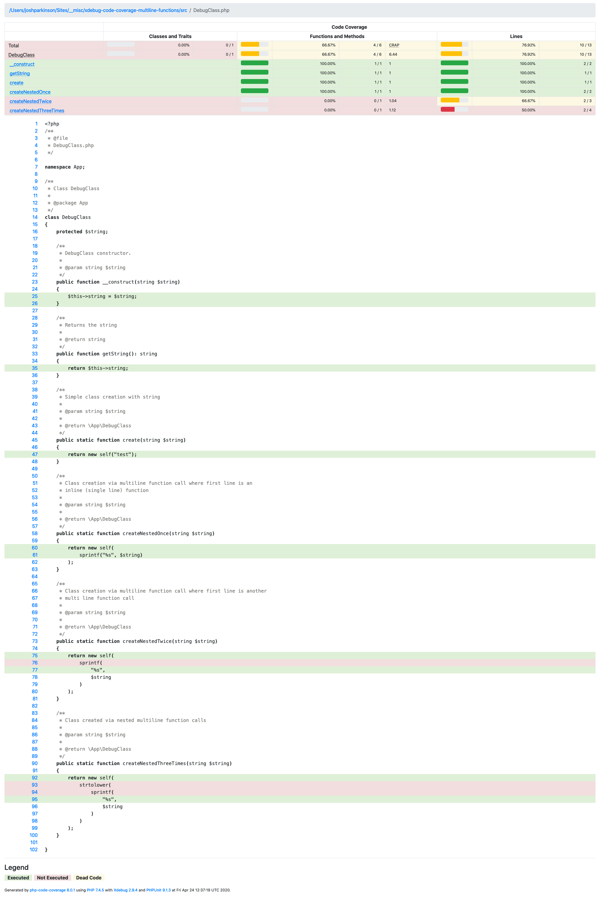

# Reproducible Bug: Xdebug Code Covered Nested Multiline Functions

Issue URL: https://bugs.xdebug.org/view.php?id=1779

## Bug Description

Nested multiline functions have the line containing just the function name shown
as not executed in xdebug code coverage.

## Running

```
$ composer install
$ composer run test
$ composer run open
```

_if your browser does not support the `open` command manually open
`./var/coverage/index.html` in your browser afte running `$ composer run test`_

## Coverage


